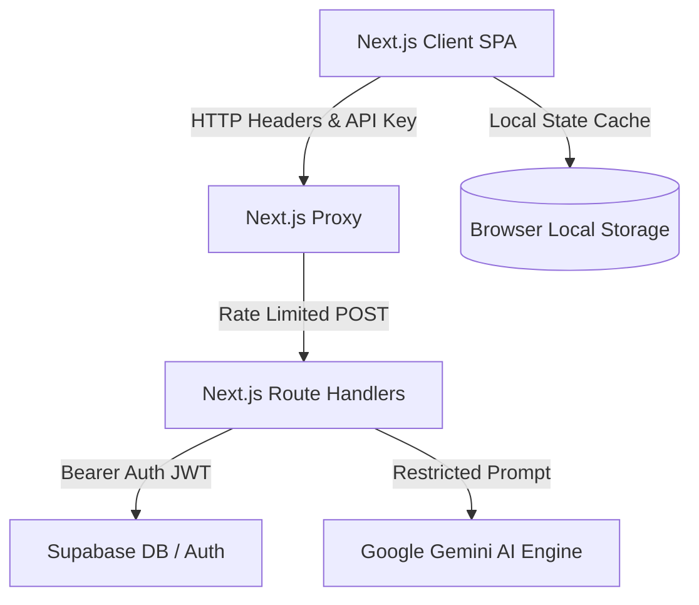

# CliniHome AI — System Architecture Specification

This document details the software architecture, data flows, and security model of the CliniHome AI healthcare platform.

---

## 1. System Overview

CliniHome AI is a modern Next.js patient-centric application integrating local sandbox mechanisms with secure cloud database operations. It provides a peaceful, Apple-inspired interface that allows users to manage their health parameters, analyze skin conditions, translate laboratory reports, set medicine alarms, and connect with specialist providers.

---

## 2. Core Architectural Layers

### 2.1 Presentation Layer (Client-Side SPA)
- Built using **React 19** and **Next.js 16 (App Router)**.
- Designed with **Vanilla CSS design tokens** located in `app/globals.css` ensuring premium typography, smooth transitions, and matte dark-mode variables.
- Utilizes state persistence with browser `localStorage` acting as a localized database cache for offline and sandbox usage.

### 2.2 Routing & Security Layer (Proxy)
- **Root Proxy (`proxy.ts`)**: Injects route protection on `/dashboard`, `/profile`, `/scan`, `/report`, `/chat`, and `/tracker`. It reads the `clinihome-session` cookie and redirects unauthorized requests to `/login`.
- **Admin Boundary**: Restricts routes starting with `/admin` to authenticated accounts verified as "doctor" providers.
- **Next.js Headers (`next.config.ts`)**: Sets security headers like `X-Frame-Options` and `Strict-Transport-Security`.

### 2.3 Server-Side API Handler Layer
- Server-side routes handle AI calls and database management tasks:
  - `/api/analyze/skin`: Vision-based dermatology categorization.
  - `/api/analyze/report`:Vision and text blood panel biomarker analysis.
  - `/api/chat/bot`: Conversational triage assistant.
  - `/api/chat/doctor`: Simulated consulting provider chat.
  - `/api/tracker/coach`: Weekly habit metrics health dashboard.
- **Request Authorization (`lib/api-auth.ts`)**: Validates inbound requests by inspecting Bearer tokens. It verifies full Supabase JWT tokens via `supabase.auth.getUser()` or formats sandbox fallback session keys.
- **IP Rate Limiting**: Tracks requests via an in-memory client IP map, returning `429 Too Many Requests` when limits are breached to prevent billing abuse.

### 2.4 Data & AI Services Layer
- **Supabase Cloud DB**: Handles auth tables, profile records, doctor directories, and reports storage. RLS policies protect patient privacy.
- **Gemini AI Engine (`gemini-2.5-flash`)**: Dynamically processes patient details, biomarkers, and skin images based on localized prompts matching the patient's language preference (English, Hindi, or Hinglish).

---

## 3. Data Synchronization & Sandbox Pattern

CliniHome AI employs a **Sandbox Fallback Pattern** to support offline use and database-less test environments:
1. When Supabase configuration keys are missing or database connection fails, the login page routes the session into **Sandboxed Mode**.
2. Profile metrics, reminder timers, and chat streams are cached directly to `clinihome-*` keys in `localStorage`.
3. When database connectivity is restored, the onboarding flow synchronizes the localized cache to Supabase tables.
4. Users can manually back up and restore their local cache using JSON file imports under `/profile`.
